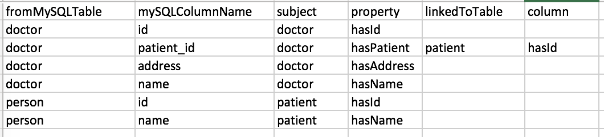

# Manual

## Prerequisitues to use Script:
* Doker
* Existing Knora Account

## How to use this Script
* Git Clone this repository
* Save your mysql dump in the src folder with the name dump.sql
* Enter your Credentials in the import.py file
* Enter the URL of the Knora instance that you would like to use
* Create the mapping
* Execute the script

## Example Walkthrough
* Imagine you have the following [mysql dump](https://github.com/nie-ine/Scripts/blob/master/MySQLToKnora/src/dump.sql) that you want to import to Knora
* Create a mapping between the mysql scheme and the triples, it could look like this:

Explanation: The entries in the column "address" of the mysql table "doctor" will be stored in the property "hasAddress" of the resource (here called subject) "doctor". Note that those resources and properties have to already exist in the Knora instance you would like to address.
* Save the mapping as [mapping.csv](https://github.com/nie-ine/Scripts/blob/master/MySQLToKnora/src/mapping.csv) in the src folder.
* Execute the script UseThisScriptToStart.sh